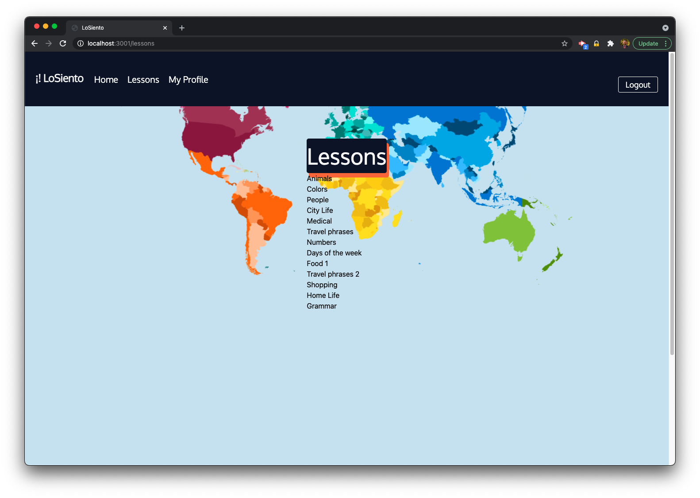

# LoSiento - Learn Spanish Fast!

## Description

LoSiento is a simple language learning app that utilizes the power of IBM's Watson to help you learn Spanish. It was created by Rony Braswell, Sam Gates, Brian McMullen, and Abner Toribio.

The app utilizes a database of custom, ten-word lessons that are originally written in English. When a user selects a lesson, our API queries Watson and builds a flashcard based lesson for them. The front of the flashcard is the English word, and the back is Spanish. Our app keeps track of the lessons you complete, and displays user activity on the front page. All of this is done to encourage more learning. Quickly learn Spanish or keep your mind on Spanish while you're on the go!

Our app also has an API that allows others to access our lesson plans. This offers the general public the same functionality we have on our site. Check out the API documentation below.

## Table of Contents

- [Deployed](#deployed)
- [Installation](#installation)
- [Usage](#usage)
- [API](#API)
- [Contribute](#contribute)
- [Test](#test)
- [License](#license)
- [The Team](#the-team)

## Deployed

Our app is currently deployed on Heroku and accessible to anyone to try out. Please visit https://losiento.herokuapp.com/ to see our app's functionality.

## Installation

You can install this project by cloning our repo or downloading our files. Seed files are provided to populate the database with test users, some basic lessons, and sample history entries.

## Usage

To use the app, either look at our live demo version or create your own local version following the instructions above. You will see the sample user history on the main page. Create an account by clicking "Sign Up". Once signed up, you will be logged in. Click "Lessons" and you can choose from a variety of different lessons - our API will build your lesson for you and display it in an easy to use, flashcard layout! Hover your cursor over each card to see the correct Spanish word.

## API

The general public can access our Watson-powered lessons using the LoSiento API. User history is also available. User history can be accessed by user or by lesson. To receive a JSON list of all lessons, send a GET request to **_/api/lesson_**.

To build an individual lesson with Watson, take the lesson ID from the /lesson/ response and send a POST request to **_/api/lesson/[lesson_id]_**. You will receive a JSON array with an object containing the English word or phrase paired with the Spanish word or phrase. You can then use this data in your own user interface.

POST is used because there is future capcity to allow you to choose a language. This feature is not active yet.

For History, the **_/api/history_** GET route will return the latest 20 updates to user activity. If you send a GET request to **_*/api/history/user/[user_id]*_** you can see the last 10 things that user did on the site. If you send a GET request to **_/api/history/lesson/[lesson_id]_** you can see the last 10 results for that history lesson, i.e. which users took that lesson recently.

## Contribute

Make improvements and reach out to us to let us know how we can make the app better.

## Test

Download or clone the repo, type npm install, set up your database, seed the database, start the server, and start experimenting with our code.

## The Team

Contact us if you have any questions or want to provide feedback on our code.

- [Rony Braswell](https://github.com/ronyelon)
- [Sam Gates](https://github.com/sg0703)
- [Brian McMullen](https://github.com/MrBmmc)
- [Abner Toribio](https://github.com/AbnerTor)

## License

Copyright (c) Rony Braswell, Sam Gates, Brian McMullen, and Abner Toribio. All rights reserved.
Licensed under the [MIT](https://opensource.org/licenses/MIT) license.

## Pictures

The background image used on our site can be downloaded [here](https://i1.wp.com/www.superlativerecruitment.com/wp-content/uploads/2020/01/World-Map-PNG-Background-Image.png).
